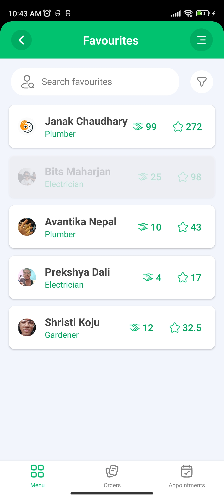

# LocalEyes

**LocalEyes** is a React Native application designed to connect users with trusted local service providers such as plumbers, electricians, tutors, and more. Built on community-generated insights, LocalEyes ensures that users can find service providers recommended by their neighbors, fostering trust and reliability within local communities.

## Table of Contents

- [Proposal](#proposal)
- [Features](#features)
- [Packages and Libraries Used](#packages-and-libraries-used)
- [Basic Workflow](#basic-workflow)
- [Installation](#installation)
- [Running the App](#running-the-app)
- [Screenshots](#screenshots)
- [Contact](#contact)
- [Contributing](#contributing)
- [License](#license)

## Proposal

In the initial version, LocalEyes will empower users to connect with local service providers—plumbers, electricians, tutors, and more—based on authentic, community-generated insights. This approach ensures that service providers are vetted and recommended by those who know them best—their neighbors. LocalEyes is built on the principle that the true quality of local services can only be seen through the eyes of other locals, fostering a community where trust and reliability are paramount.

## Features

- **Category-Wise Providers**: Users can browse service providers categorized by their specific services.
- **Favorites Screen**: Users can add or remove service providers from their favorites list for quick access.
- **Appointments & Orders**: Users can book appointments and place orders with service providers.
- **Profile Management**: Users can view and edit their profiles, manage orders, and more.
- **Booking Flows**: Users can book a service, provide task details, select location, and choose date and time.
- **Onboarding Screen**: A guided onboarding experience for first-time users.
- **Firebase Authentication**: Secure user authentication using Firebase Auth.
- **Firestore Integration**: Robust data handling using Firestore for service providers, orders, and reviews.
- **Firebase Storage**: Handling image uploads for user profiles and service providers.
- **Rate Service Providers**: Users can rate and review service providers after the service is completed.
- **Review Management**: Track the number of ratings and reviews a provider has received.

## Packages and Libraries Used

- `@notifee/react-native`: Notifications handling.
- `@react-native-async-storage/async-storage`: Local storage management.
- `@react-native-firebase/app`: Firebase core module.
- `@react-native-firebase/auth`: Firebase Authentication.
- `@react-native-firebase/firestore`: Firestore database integration.
- `@react-native-firebase/storage`: Firebase Storage for handling images.
- `@react-native-seoul/masonry-list`: Masonry-style list layout.
- `@react-navigation/bottom-tabs`: Bottom tab navigation.
- `@react-navigation/drawer`: Drawer navigation.
- `@react-navigation/native`: Core navigation functionality.
- `@react-navigation/native-stack`: Native stack navigation.
- `@react-navigation/stack`: Stack navigation.
- `lottie-react-native`: Lottie animations integration.
- `moment`: Date and time manipulation.
- `react-native-date-picker`: Date picker component.
- `react-native-gesture-handler`: Gesture handling.
- `react-native-image-picker`: Image picker for selecting and uploading images.
- `react-native-onboarding-swiper`: Onboarding swiper for initial user setup.
- `react-native-ratings`: Star rating component.
- `react-native-reanimated`: Advanced animations handling.
- `react-native-safe-area-context`: Handling safe area views.
- `react-native-screens`: Native screen optimizations.
- `react-native-svg`: SVG support for React Native.
- `react-native-svg-transformer`: SVG transformation.
- `react-navigation`: Navigation package.

## Basic Workflow

1. **Onboarding**: Displayed when the app is launched for the first time.
2. **Authentication**: User can log in or register using Firebase Auth.
3. **Home Screen**: Displays different service categories.
4. **Provider Screen**: Shows all providers in the selected category.
5. **Provider Profile**: Displays details of the selected provider, along with options to book services or add to favorites.
6. **Booking Flow**: Users can provide task details, set location and date/time, and confirm the booking.
7. **Appointment Management**: Providers can accept or reject appointments. Accepted bookings are added to the user's pending screen.
8. **Pending Screen**: Displays pending orders. Users can rate the provider, call them directly, or delete the order.
9. **Rating & Reviews**: Users can rate providers, updating their total reviews and ratings.

## Installation

### Prerequisites

- Ensure you have [Node.js](https://nodejs.org/en/) and [React Native CLI](https://reactnative.dev/docs/environment-setup) installed on your system.

### Steps

1. Clone the repository:
   ```bash
   git clone https://github.com/yourusername/LocalEyes.git
   cd LocalEyes
2. Install the required dependencies:
   npm install

### Screenshots

Below are some screenshots showcasing the features of the LocalEyes app:





### Contact
Email: sh.suyan16@gmail.com
LinkedIn: Suyan Shrestha
Twitter: @suyanshrestha

### Contributing
If you would like to contribute to the project, please fork the repository and submit a pull request. Contributions are welcome!